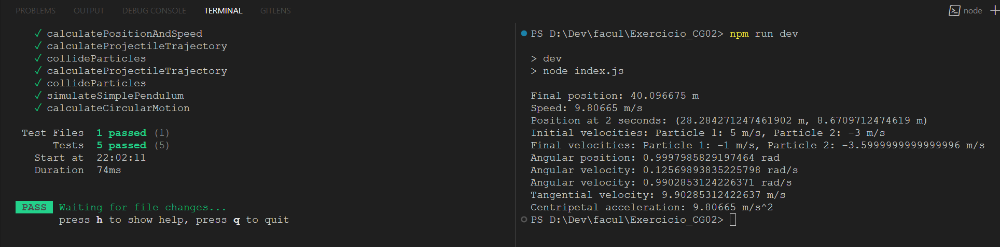

### Alunos
Anthony de Zutter e
Reinaldo Dos Santos Junior

# exercicio_cg02

### Instalar e usar

```ruby
npm install
npm run dev
npm run test
```



### Questões

1. Simulação de queda livre: Escreva um programa que calcule a posição e a velocidade de um
   objeto em queda livre, considerando a aceleração devida à gravidade. O usuário pode inserir
   a altura inicial do objeto e o programa deve calcular a posição e velocidade em intervalos de
   tempo específicos.
2. Movimento de um projétil: Desenvolva um algoritmo que simule o movimento de um projétil
   lançado com uma determinada velocidade e ângulo em relação ao solo. O programa deve
   calcular a trajetória do projétil e determinar sua posição em diferentes momentos.
3. Colisão de partículas: Crie um programa que simule a colisão elástica entre duas partículas em
   um espaço bidimensional. O usuário pode fornecer as massas e velocidades iniciais das
   partículas, e o programa deve calcular as velocidades finais após a colisão.
4. Pendulo simples: Escreva um algoritmo que simule o movimento de um pêndulo simples. O
   programa deve calcular a posição angular do pêndulo em relação ao tempo, levando em
   consideração a massa do objeto pendurado, o comprimento da corda e a força gravitacional.
5. Movimento circular uniforme: Desenvolva um programa que calcule a velocidade angular, a
   velocidade tangencial e a aceleração centrípeta de um objeto em movimento circular
   uniforme. O usuário pode inserir o raio da trajetória circular e a velocidade angular, e o
   programa deve calcular as outras quantidades físicas.
